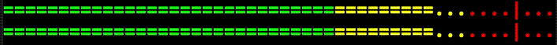

# NDI Volume Meter

Simple C++ volume meter for monitoring of NDI streams. Consumes minute amount of resources (1.4 % of a single i5 CPU
core, under 2 MB of memory, 200 KBps bandwidth) and works as-realtime-as-NDI-allows.

## Dependencies

- CMake
- NDI SDK
- nCurses

## Build notes

Tested just on a Mac, but should work on other platforms as well, please start an issue if you would like a direct
support on other OS.

## Usage

The executable takes no arguments. Just run it and it should display a selection of NDI sources available in your
network. If not, verify with NDI Video Monitor that you are able to reach any stream.

After insertion of an index and confirmation by <kbd>Enter / Return</kbd>, volume meter such as following should appear
on screen for each audio channel:

The volume meter is split into green (under -20 dBFS), yellow (under -9 dBFS) and red sections. If they are not colored
in your terminal, please switch to one that supports colors. Each character denotes one dBFS and, therefore, width of
terminal window defines the range of the meter. In the example above, the meter starts at -50 dBFS.

The moving `=` section denotes a peak programme meter with a decay of 1 dBFS per NDI audio frame.

The holding `|` mark denotes a peak from last 10 seconds.

As a heartbeat check, last line contains a rolling timestamp provided by NDI frame itself.

## Contributing

Please use, share, fork or distribute it for free of charge
(or <a href="https://www.buymeacoffee.com/petrpulc" target="_blank">Buy Me A Coffee</a> if you used it on a paid gig).